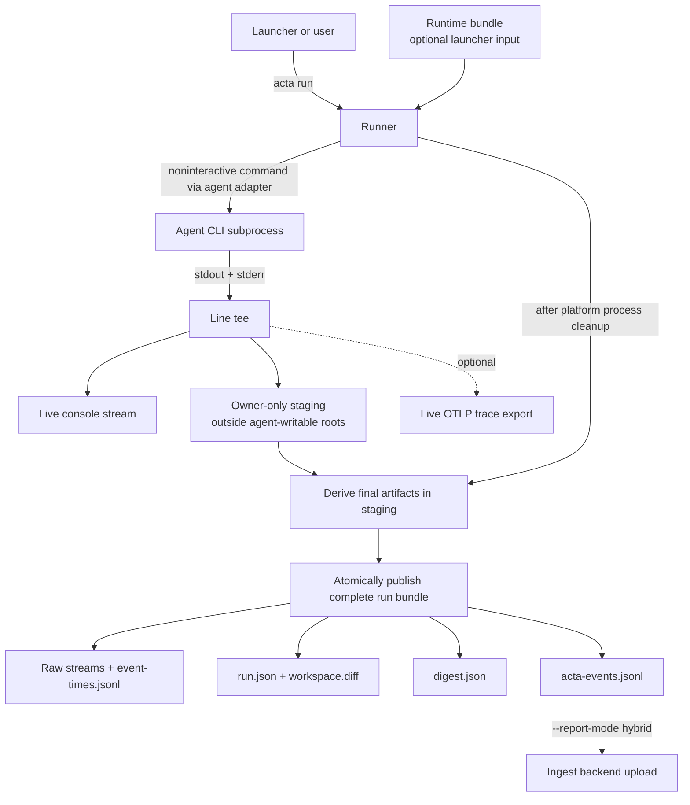

# Architecture

Acta records noninteractive coding-agent runs. The CLI should stay focused on
launching agents, preserving raw streams, and producing stable Acta-owned run
records.

## Boundaries

Acta owns:

- launching supported agent CLIs in noninteractive mode
- streaming and capturing stdout/stderr
- writing local run bundles
- normalizing raw agent output into `digest.json` and `acta-events.jsonl`
- exporting runs as live OTLP traces and uploading completed bundles to an
  ingest backend

Acta does not own:

- Docker or VM orchestration
- repository checkout lifecycle
- branch, commit, or pull request policy
- benchmark dataset management

Those concerns can wrap Acta from a hosted runner, CI workflow, or companion
service.

## Current Flow



The bundle is published after Acta cleans up the agent's platform process
container. Windows uses a Job Object. POSIX uses a process group; a child that
creates a new session or process group is outside that portable contract. Live
consumers (console, OTLP) see the run as it happens, while the bundle stays the
durable source of truth.

## Adapter Boundary

Each agent adapter maps an Acta run request to a subprocess command.

```text
RunRequest -> AgentAdapter -> CommandSpec -> runner.Run
```

The adapter should contain vendor-specific CLI flags. The runner should remain
agent-agnostic.

## Runtime Bundles

A launcher may pass `--runtime-bundle <absolute path>`: a private,
schema-versioned JSON file describing the capabilities the agent runs with
(MCP servers, tools, managed skills). Acta validates the bundle before use:
owner-only permissions, bounded size, and no embedded secret values, since
credentials may only be referenced by name or environment variable. Validated
entries map to the agent's documented flags. Managed SKILL.md files are copied
into Acta's protected staging directory, kept outside the agent's writable
roots, and removed after the agent exits.
Owner-only means mode `0600` on POSIX. On Windows, where Go's permission bits
are synthetic, the current user must own the file and its DACL may grant access
only to that user, Local System, and built-in Administrators.
An authoritative Codex runtime bundle is rejected when the repository has a
project `.codex/config.toml`, because `--ignore-user-config` does not suppress
that separate configuration layer and Acta will not merge authorities
implicitly.

For a Codex runtime bundle, the bundle is authoritative for Acta's supported
configuration surface: user config and exec-policy rules are ignored, strict config parsing and
ephemeral sessions are enabled, omitted supported tools are explicitly
disabled, and MCP/skill configuration starts empty before declared entries are
applied. Repository instructions remain discoverable. Claude runtime bundles
are not supported; Claude runs load project settings only, keep project
instruction discovery, and disable session persistence.

Run provenance records the effective configuration mode for every adapter.
Runtime-bundle runs also record the lowercase SHA-256 of the exact opened JSON
bytes; Acta does not record the bundle path or contents.

## Raw First

Acta preserves raw agent streams before trying to interpret them. This makes
runs replayable and lets parsers improve without rerunning expensive agent
tasks.

Raw files are considered evidence. Normalized events are product views over that
evidence.

The final bundle directory is deliberately absent while the agent is running.
Acta stages raw output under the owner-only user cache, outside the workspace
and every declared extra writable root, then publishes it only after the agent
platform process cleanup completes. Derived artifact rewrites use same-directory atomic
replacement, and upload rejects symlinks or artifacts resolving outside the
bundle.
Staging also rejects roots beneath the system temporary directory, even when
an environment variable points the user cache there, and falls back to an
owner-only directory beneath the user's home directory.

Publication renames a complete directory atomically. Only a cross-device
rename error selects the copy path; other rename failures are returned without
changing strategy. Cross-device publication copies into a private sibling
temporary directory and atomically renames that completed copy. If publication
still fails, Acta retains the complete bundle and records/reports its
`recovery_dir` rather than deleting the only recoverable evidence.

## Event Model

The durable replay contract is `acta-events.jsonl`, an Acta-native event
stream separate from vendor JSONL:

```text
run.started
agent.message
agent.reasoning
agent.todo
agent.lifecycle
tool.call.completed
shell.command.completed
file.read
file.written
diff.generated
tokens.reported
run.completed / run.failed
```

OTEL export maps this model into spans (see Live Trace Export), but OTEL is a
projection, not the only product schema.

## Live Trace Export

Acta can export each run as one OpenTelemetry trace over OTLP/HTTP while the
run happens (`--otlp-endpoint`, or the standard `OTEL_EXPORTER_OTLP_*`
variables). Spans follow the GenAI semantic conventions and carry structural
metadata only (tool names, ids, exit codes, tokens, timing) unless
`--otlp-include-output` opts content in. The resulting `trace_id` is recorded
in `run.json` so a bundle can be correlated with the trace backend afterwards.
Export is a live view of the run; the bundle remains the source of truth.
Configured exporters are best-effort by default. Launchers that require
delivery select `--otlp-export-failure-policy required`; setup/flush status
remains recorded, and failure is returned after the bundle is finalized
without changing the agent outcome.

## Report Upload

Acta supports `--report-mode hybrid` for completed-run upload to an ingest
backend. Hybrid mode preserves the local bundle, then posts:

- run metadata to `POST /api/ingest/runs`
- `acta-events.jsonl` to `POST /api/ingest/runs/{run_id}/events`
- terminal event artifact references as raw-body artifact uploads to
  `POST /api/ingest/runs/{run_id}/artifacts`
- terminal status to `POST /api/ingest/runs/{run_id}/complete`

Hybrid upload requires `--report-token` or `--report-token-env`, which Acta
sends as an ingest bearer token. Local standalone uploads may use the raw local
dev token and omit organization scope. Launchers should prefer
`--report-token-env`/`--ingest-token-env` so the token value is not exposed in
process argv. Acta removes the named token variable from the agent subprocess
environment after reading it. Production-scoped uploads pass a short-lived
scoped ingest token plus `--run-id`, `--organization-id`, and `--repository-id`;
the launcher must mint the scoped token for the same run id it passes to Acta. Acta
creates the remote run as `running`, then posts the terminal status only
after events and artifacts are accepted. Artifact uploads stream bytes from disk, include
`size_bytes` and `sha256` metadata, and rely on the backend's content-addressed
artifact keys for safe retries. Event uploads are split into bounded batches so
large trajectories do not hit the backend's JSON request limit. Upload retries
transient HTTP failures. Non-transient ingestion failures fail the Acta command
instead of silently degrading to local-only.
Upload requests do not follow redirects, preventing bearer credentials from
being forwarded to a different or downgraded endpoint.

`--report-mode stream` is intentionally not implemented yet. Live streaming
should be added only after the hybrid upload path is stable.
